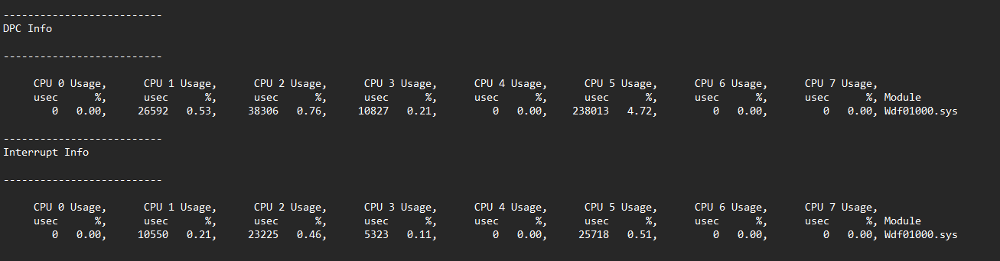

# Research

## Table of Contents

- [Which NICs/drivers support Receive Side Scaling (RSS)?](#which-nicsdrivers-support-receive-side-scaling-rss)

## Which NICs/Drivers Support Receive Side Scaling (RSS)?

There are two main network driver interfaces: NDIS ("Windows 10 drivers") and NetAdapterCx ("Windows 11 drivers").

### Intel

Intel's NetAdapterCx drivers ignore most registry settings related to RSS, making it impossible to control which cores DPCs/ISRs will be routed to, the driver decides this on it's own disregarding the registry settings:

For this reason, it's recommended to use an NDIS driver on Intel NICs, as those drivers follow the RSS registry settings properly.

- To install an NDIS driver for an Intel NIC on a Windows 11 system, extract the installer .exe file via 7-Zip, then install the driver from the corresponding NDIS68 folder through Device Manager.

Verify that you installed the correct driver by running an xperf trace while an internet speedtest is running:

- Network DPCs and ISRs are handled by `ndis.sys` - an NDIS driver is installed

- Network DPCs and ISRs are handled by `Wdf01000.sys` - a NetAdapterCx driver is installed

 

In the [patch notes](https://downloadmirror.intel.com/785800/readme_28.2.txt) of the 28.2 Intel Network Adapter Driver, RSS is noted as a removed feature

- Despite this, RSS still continues to function when configured following the [instructions in Guidance](README.md#receive-side-scaling-rss-configuration)

### Realtek

Realtek's drivers with both interfaces have a proper RSS implementation.

> [!IMPORTANT]
> RSS doesn't properly function when using more than 1 RSS queue on some systems with Realtek NICs. It's unclear why and on which systems this happens.
>
> Experiment with disabling SMT/Hyper-Threading as this resolved the issue for some people.

If you're planning to use RSS, consider avoiding motherboards with Realtek NICs as their RSS functionality has proven to be unreliable.