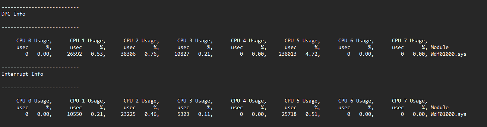

# Research

## Table of Contents

- [Which NICs/Drivers Support Receive Side Scaling (RSS)?](#which-nicsdrivers-support-receive-side-scaling-rss)
- [Windows 11 24H2 AutoBoost Behavior](#windows-11-24h2-autoboost-behavior)

## Which NICs/Drivers Support Receive Side Scaling (RSS)?

There are two main network driver interfaces: NDIS ("Windows 10 drivers") and NetAdapterCx ("Windows 11 drivers").

According to Microsoft, [NetAdapterCx delivers improved performance and reduced latency compared to NDIS](https://techcommunity.microsoft.com/blog/networkingblog/introducing-the-netadapter-driver-model-for-the-next-generation-of-networks-and-/339722) as it uses a polling-based IO model instead of the interrupt-driven model used by NDIS. However, NetAdapterCx is not always the optimal pick due to the reasons explained below.

### Intel

Intel's NetAdapterCx drivers ignore most registry settings related to RSS, making it impossible to control which cores DPCs/ISRs will be routed to, the driver decides this on it's own disregarding the registry settings:



For this reason, I recommend using an NDIS driver on Intel NICs, as those drivers follow the RSS registry settings properly.

- To install an NDIS driver for an Intel NIC on a Windows 11 system, extract the installer .exe file via 7-Zip (this is no longer neccesary, as these files come pre-extracted with latest driver versions), then install the driver from the corresponding NDIS68 folder through Device Manager

Verify that you installed the correct driver by running an xperf trace while an internet speedtest is running:

- Network DPCs and ISRs are handled by `ndis.sys` - an NDIS driver is installed

- Network DPCs and ISRs are handled by `Wdf01000.sys` - a NetAdapterCx driver is installed

<br>

RSS is noted as a removed feature in the [patch notes](https://downloadmirror.intel.com/785798/readme_28.2.txt) of the 28.2 Intel Network Adapter Driver. Despite this, RSS still continues to function when configured following the [instructions in Guidance](/README.md#receive-side-scaling-rss-configuration).

### Realtek

Realtek's drivers with both interfaces have a proper RSS implementation.

> [!IMPORTANT]
> RSS doesn't properly function when using more than 1 RSS queue on some systems with Realtek NICs. It's unclear why and on which systems this happens.
>
> Experiment with disabling SMT/Hyper-Threading as this resolved the issue for some people.

If you're planning to use RSS, consider avoiding motherboards with Realtek NICs as their RSS functionality has proven to be unreliable.

## Windows 11 24H2 AutoBoost Behavior

AutoBoost is a Windows thread scheduler framework targeted at the priority-inteversion problem, as described in Windows Internals:

> Imagine the following situation: A priority 7 thread is running, preventing a priority 4 thread from ever receiving CPU time. However, a priority 11 thread is waiting for some resource that the priority 4 thread has locked. But because the priority 7 thread in the middle is eating up all the CPU time, the priority 4 thread will never run long enough to finish whatever it’s doing and release the resource blocking the priority 11 thread. This scenario is known as *priority inversion*.

> Autoboost is a framework targeted at the priority-inversion problem described in the previous section. The idea is to track lock owners and lock waiters in such a way that would allow boosting the appropriate threads’ priorities (I/O priority as well if needed) to allow threads to make forward progress.

According to Windows Internals, the maximum priority achievable by AutoBoost (and other priority boosts) is 15. In other words priority boosting shouldn't enter a thread into the real-time priority range.

However, along with [other changes](https://x.com/sixtyvividtails/status/1886311105917509800) to the scheduler, the behavior of AutoBoost has changed in Windows 11 24H2.

<br>

During a gaming session, I checked [Process Explorer](https://learn.microsoft.com/en-us/sysinternals/downloads/process-explorer) and noticed that the main game thread had been boosted to the priority of 21, into the real-time range, which struck me as odd. After a lot of experimentation, I realized the game threads were getting boosted to the priority of certain DWM threads, as they got boosted to priority 16 by default, but got boosted to 21 when [DwmEnableMMCSS](https://learn.microsoft.com/en-us/windows/win32/api/dwmapi/nf-dwmapi-dwmenablemmcss) was active. I was also able to replicate the same behavior on other processes.

Further investigation with WinDbg showed that certain threads from any GUI process are susceptible to boosts into the real-time range, and in fact get boosted during any mouse movement over their window. A boost also occurs to all relevant GUI threads when a change of the foreground window occurs.

The following WinDbg command can be used to monitor priority changes in and out of the real-time range, showing the call stack during the priority change - replace 0n99999 with the thread ID of the thread of interest, usually the one with highest CPU usage during window movement (huge thanks to [sixtyvividtails](https://x.com/sixtyvividtails) for help with WinDbg):

```
dx @$t0 = (void*)(&@$cursession.Processes.SelectMany(p => p.Threads).First(t => t.Id == 0n99999).KernelObject.Tcb.Priority); r$t1=0; ba w1 @$t0 "r$t2=by(@$t0); .if (@$t2 != @$t1 and (@$t1 >= 10 or @$t2 >= 10)) { .printf \"thread priority change: 0n%02d -> 0n%02d\\n\", @$t1, @$t2; k}; r$t1=@$t2; g"
```

<br>

An example of a stack trace during the priority change looks like this (`notepad.exe`):

```
thread priority change: 0n10 -> 0n16
 #  Call Site
00  nt!KiUpdateThreadPriority+0x48
01  nt!KiSetPriorityThread+0xbf
02  nt!KiAbCpuBoostOwners+0x2da
03  nt!KiAbProcessThreadLocks+0x67d
04  nt!KiSwapThread+0x15d
05  nt!KiCommitThreadWait+0x271
06  nt!KeWaitForSingleObject+0x773
07  nt!ExpWaitForFastResource+0x92
08  nt!ExpAcquireFastResourceExclusiveSlow+0x1e5
09  nt!ExAcquireFastResourceExclusive+0x1bd
0a  win32kbase!<lambda_63b61c2369133a205197eda5bd671ee7>::<lambda_invoker_cdecl>+0x2b
0b  win32kbase!UserCritInternal::`anonymous namespace'::EnterCritInternalEx+0x4d
0c  win32kbase!EnterCrit+0x44
0d  win32kfull!LeaveEnterUserCritIfAcquired::~LeaveEnterUserCritIfAcquired+0x45
0e  win32kfull!xxxClientCallDitThread+0x149
0f  win32kfull!ClientCallDitThread+0x9
10  win32kbase!ClientCallDitThread+0x42
11  win32kbase!ApiSetClientCallDitThread+0x66
12  win32kbase!CSpatialProcessor::SpeedHitTest+0x136
13  win32kbase!DCompHitTest+0x28
14  win32kbase!CMouseProcessor::MouseSpeedHitTest+0x1db
15  win32kbase!CMouseProcessor::MouseHitTest+0x268
16  win32kbase!CMouseProcessor::ProcessMouseMove+0x24e
17  win32kbase!CMouseProcessor::ComputeAndDeliverMouseMove+0xc8
18  win32kbase!CMouseProcessor::xxxProcessMouseEvent+0x309
19  win32kbase!xxxProcessMouseEvent+0x16
1a  win32kbase!HandleMITWakeSignal+0x1be
1b  win32kbase!<lambda_0f9e2a8fc479216b45af02f10e3c5bbd>::<lambda_invoker_cdecl>+0x9
1c  win32kbase!NtMITDispatchCompletion+0x212
1d  win32k!NtMITDispatchCompletion+0x3e
1e  nt!KiSystemServiceCopyEnd+0x25
1f  0x00007ffd`bf427a44
20  0x00007ffd`b281ffe1
```

Take note of call stack entries `02 nt!KiAbCpuBoostOwners+0x2da` and `03 nt!KiAbProcessThreadLocks+0x67d` - they show us that the boost in question is initiated by the AutoBoost framework. It's not clear whether the change of allowing AutoBoost to boost threads into the real-time range is an intentional change made in 24H2 or a bug.

Since the threads are getting boosted to the priority of DWM threads, the cause is likely a lock between the GUI thread and the DWM thread. When all works as expected, the priority of the thread gets reset back to it's original priority after mouse movement over it's window ends as there is no more lock between the GUI thread and the DWM thread, aligned with usual AutoBoost behavior.

But if the priority goes back to normal when there is no mouse movement, why was the priority *stuck* at 21 when I originally checked it in Process Explorer? It's worth noting that the threads get *stuck* in the real-time range after seemingly random amounts of time: sometimes in seconds, sometimes in hours; depending on the observed thread and timing variability, indicating a possible race condition. After the thread priority gets *stuck*, I have not found a way to reset it back to normal without fully ending the process/thread.

At this time, I also came across an instance of the NVIDIA driver boosting a thread into the real-time range (`CPUSTRES64.exe`):

```
thread priority change: 0n15 -> 0n16
 #  Call Site
00  nt!KiUpdateThreadPriority+0x7a
01  nt!KiSetPriorityThread+0x9b
02  nt!KeSetPriorityThread+0x141
03  nvlddmkm+0x1458e7
04  nvlddmkm+0xf5611
05  nvlddmkm+0xf6ba0
06  nvlddmkm+0x26578f
07  nvlddmkm+0x24581a
08  nvlddmkm+0x3ca67b
09  nvlddmkm+0x24537d
0a  nvlddmkm+0x254bf0
0b  nvlddmkm+0x254f03
0c  nvlddmkm+0x1512f0
0d  nvlddmkm+0x149f85
0e  nvlddmkm+0x14a378
0f  nvlddmkm+0xd89ed
10  nvlddmkm+0x1821797
11  nvlddmkm+0xd7cd17
12  nvlddmkm+0x1821c04
13  nvlddmkm+0x1797c1b
14  nvlddmkm+0x17961b8
15  nvlddmkm+0x1795681
16  nvlddmkm+0x179234b
17  nvlddmkm+0x178be81
18  nvlddmkm+0x1764f84
19  nvlddmkm+0x173fff8
1a  dxgkrnl!DXGDEVICE::CreateDriverAllocations+0x300
1b  dxgkrnl!DXGDEVICE::CreateAllocation+0x63c
1c  dxgkrnl!DXGDEVICE::CreateStandardAllocation+0x372
1d  dxgkrnl!CreateStandardAllocCallout+0x19
1e  nt!KxSwitchKernelStackCallout+0x2e
1f  nt!KiSwitchKernelStackContinue
20  nt!KiExpandKernelStackAndCalloutOnStackSegment+0x1d5
21  nt!KiExpandKernelStackAndCalloutSwitchStack+0x17c
22  nt!KeExpandKernelStackAndCalloutInternal+0x39
23  nt!KeExpandKernelStackAndCalloutEx+0x1d
24  dxgkrnl!DxgkpExpandStackAndCreateStandardAllocation+0x53
25  dxgkrnl!DxgkCddCreateAllocation+0x239
26  cdd!CddBitmapHw::RecreateDeviceAllocations+0x25f
27  cdd!CddBitmapHw::InitBitmap+0x99
28  cdd!DrvCreateDeviceBitmapEx+0xa78
29  win32kfull!MulCreateDeviceBitmapEx+0xd4
2a  win32kfull!CreateCompatibleSurface+0x34e
2b  win32kfull!GrepCreateCompatibleBitmap+0x22d
2c  win32kfull!CreateOrGetRedirectionBitmap+0x102
2d  win32kfull!SetRedirectedWindow+0xb7
2e  win32kfull!SetLayeredWindowAttributes+0xb9
2f  win32kfull!ComposeWindow+0x109
30  win32kfull!ComposeWindowIfNeeded+0x5f
31  win32kfull!SetVisible+0xb7
32  win32kfull!zzzChangeStates+0xb10
33  win32kfull!zzzBltValidBits+0x157
34  win32kfull!xxxEndDeferWindowPosEx+0x37f
35  win32kfull!xxxSetWindowPos+0xae
36  win32kfull!xxxMNOpenHierarchy+0xcf8
37  win32kfull!xxxMNButtonDown+0x87
38  win32kfull!xxxHandleMenuMessages+0x8e9
39  win32kfull!xxxMNLoop+0x1ae
3a  win32kfull!xxxSysCommand+0x442
3b  win32kfull!xxxRealDefWindowProc+0x1391
3c  win32kfull!xxxWrapRealDefWindowProc+0x73
3d  win32kfull!NtUserfnDWORD+0x5f
3e  win32kfull!NtUserMessageCall+0x18d
3f  win32k!NtUserMessageCall+0x72
40  nt!KiSystemServiceCopyEnd+0x25
41  0x00007ffb`6bb81334
```

I was also able to capture an example of a sequence of boosts leading to a *stuck* thread priority, which can be seen in [procexp-stack-traces.txt](AutoBoost/procexp-stack-traces.txt) (`procexp64.exe`). DwmEnableMMCSS was active here to highlight the difference between AutoBoost boosts and NVIDIA driver boosts. As can be seen at the start of the example, boosts both from AutoBoost and the NVIDIA driver usually get reverted, and the thread goes back to it's usual priority in the dynamic range. But, at the end of the example, the NVIDIA driver first boosts the thread to the priority of 16, then, before that boost gets reverted, AutoBoost comes along and boosts the thread to priority 21, after which the thread permanently stays at priority 21.

This is, however, not the only way a thread priority gets *stuck*. Two more examples can be seen in [cpustres-stack-traces.txt](AutoBoost/cpustres-stack-traces.txt) (`CPUSTRES64.exe`).

I confirmed that threads do not get *stuck* in the real-time priority range when an NVIDIA driver is not present on the system, and was also not able to replicate this behavior on a system with an AMD graphics card (to be clear, threads are boosted into the real-time range on all 24H2 systems during mouse movement, they just do not get *stuck* without the NVIDIA driver).

While it's not clear exactly why this happens or who's at fault, it's clear that the NVIDIA driver does not play nicely with the changes made to the AutoBoost framework. **Such behavior of user-mode threads randomly getting permanently boosted into the real-time range could result in a performance regression and even pose as a security threat, so it should be addressed by NVIDIA or Microsoft as soon as possible.**

Due to the questionable performance impact of games getting boosted into the real-time priority range during mouse movement, I would also not recommend using Windows 11 24H2 for low latency gaming for the time being.